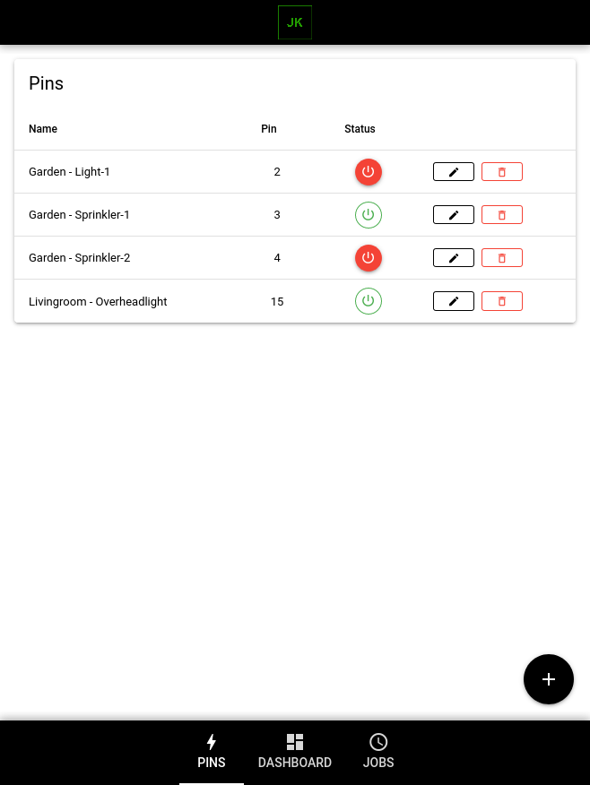
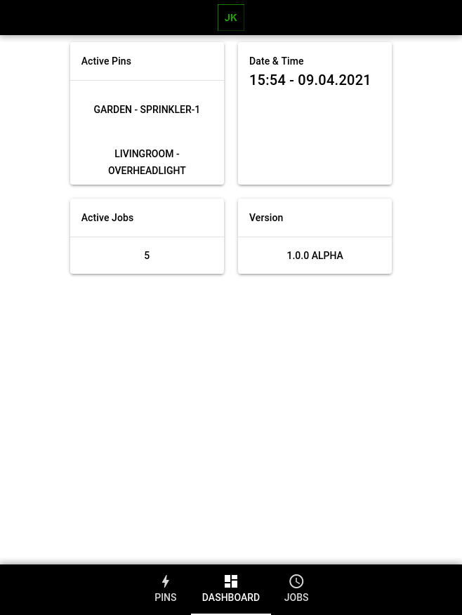
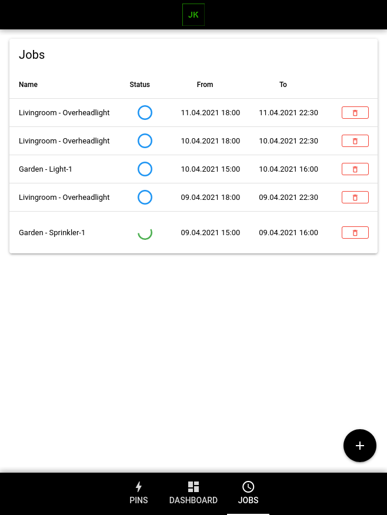

# RaspberryPi GPIO Manager Frontend Vue

RaspberryPi GPIO Manager Frontend (Vue) for RaspberryPi GPIO Manager Backend (Go)

### Develop in Dev mode (hot-code reloading, error reporting, etc.)
```bash
// First install dependencies
npm install

// Run Development Server
quasar dev
```

### Lint the files
```bash
npm run lint
```

### Build the app for production
```bash
// Webapp
quasar build

// Mobile App
quasar build -m android
```
### Screenshots

#### Pins


#### Dashboard


#### Jobs


### Use-Cases

* direct and timed switching of lights
* direct and timed switching of lawn sprinklers
* many more...

### GoodToKnow

* RaspberryPi GPIO Manager Backend Go - https://github.com/jk-powered-de/RaspberryPi-GPIO-Manager-Backend
* Product Page - https://jk-powered.de/soziale-projekte/#opensource

### Special Thanks To:
* Quasar - https://quasar.dev/ (https://github.com/quasarframework/quasar)
* VueJs - https://vuejs.org/ (https://github.com/vuejs/vue)
